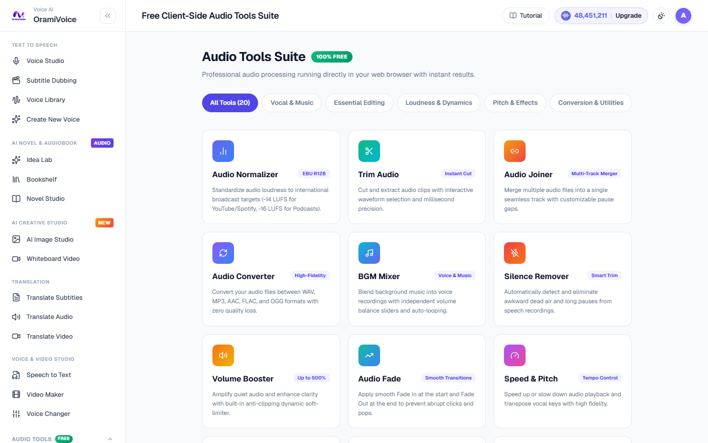
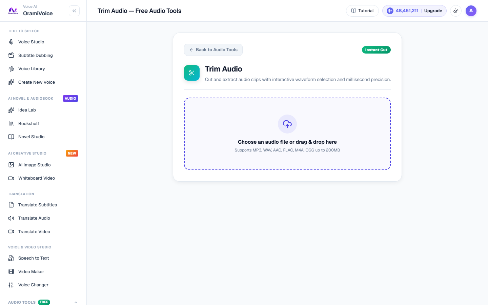

# Free Client-Side Audio Tools Suite

The Audio Tools Suite (`/tools.php`) is a collection of 20 high-performance audio processing utilities executed directly inside your web browser using modern Web Audio APIs and WebAssembly. Processing is instantaneous, requires zero server uploads, and guarantees complete data privacy.

---

## Operating Workflow & Studio Workstation

Each tool launches in a standardized, distraction-free **Studio Workstation** with real-time waveform visualization:

1. Navigate to **Audio Tools** (`/tools.php`) and choose any tool card.
2. Drag and drop your audio or video file onto the dropzone.
3. The **Studio Monitor Stage** displays the file metadata (Sample rate, Duration, Audio waveform).
4. Configure parameters on the two-column control grid (sliders with millisecond-level precision and numeric badges).
5. Click **Process Audio** to perform instant client-side Web Audio DSP rendering.
6. Audition the processed result on the built-in audio player and click **Download** to save your file.

---

## Complete Tools Catalog

### Essential Editing
- **Trim Audio**: Cut and extract audio clips with interactive waveform visualization and millisecond precision.
- **Audio Joiner**: Merge multiple audio tracks into a single continuous file with customizable pause gaps.
- **Audio Fade**: Apply smooth Fade In at the start and Fade Out at the end to prevent abrupt clicks and pops.
- **Audio Reverser**: Reverse audio playback for sound design, reverse reverb swells, and special effects.
- **Audio Loop**: Seamlessly repeat background music or ambient soundscapes multiple times into extended audio tracks.

### Loudness & Dynamics
- **Audio Normalizer (EBU R128)**: Standardize audio loudness to international broadcast targets (-14 LUFS for YouTube and Spotify, -16 LUFS for Apple Podcasts and radio).
- **Silence Remover**: Automatically detect and eliminate awkward pauses and dead air from spoken voiceovers.
- **Volume Booster**: Amplify quiet audio up to 500% with built-in anti-clipping dynamic soft limiters.
- **Audio Compressor**: Balance dynamic range between loud peaks and soft whispers for consistent broadcast presence.

### Pitch & Acoustic Effects
- **Speed & Pitch**: Adjust playback tempo from 0.25x to 4.0x and transpose vocal pitch in semitones with high-fidelity time stretching.
- **Audio Equalizer**: Sculpt frequency balance using a 3-band parametric EQ (Bass, Midrange, Treble).
- **Reverb & Echo**: Add spatial room acoustics, hall reflections, or rhythmic delay feedback to vocal tracks.
- **Voice Enhancer**: Improve vocal clarity with low-frequency rumble filtering and high-frequency presence brightening.
- **Audio Denoiser**: Filter out electronic background hum, microphone hiss, and subtle room ventilation noise.

### Conversion & Utilities
- **Audio Converter**: Convert audio files between WAV, MP3, AAC, FLAC, and OGG formats.
- **Voice Recorder**: Record crystal-clear audio directly from your microphone with real-time waveform level monitoring.
- **Stereo to Mono**: Downmix multi-channel stereo audio into a single balanced mono channel for podcasts and voice distribution.
- **Video to Audio**: Extract high-resolution audio soundtracks directly from MP4, WebM, and MOV video files.
- **Smart VAD Trimmer**: Voice Activity Detection algorithm that automatically isolates and extracts only spoken speech segments.
