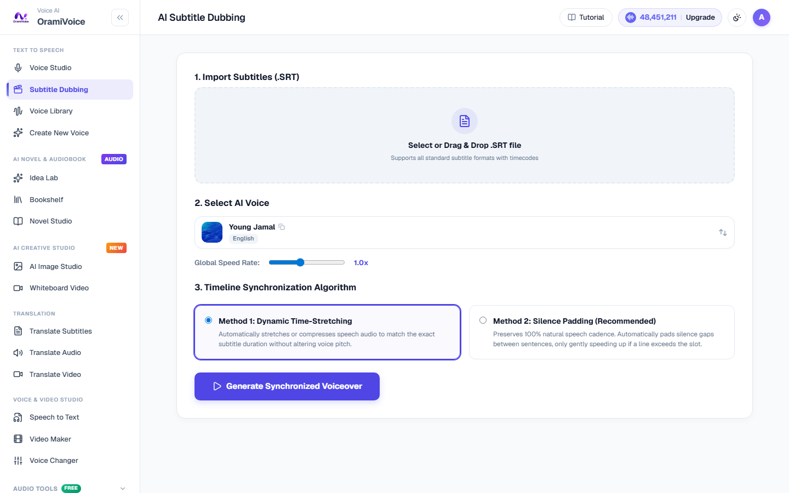

# Subtitle Dubbing Studio

The Subtitle Dubbing Studio (`/dubbing.php`) transforms standard subtitle files (SRT, VTT) and timestamped dialogue transcripts into synchronized voiceover audio tracks.

---

## Step-by-Step Dubbing Workflow

Follow these steps to generate accurate, time-synced voiceovers from video subtitles:

### Step 1: Upload Subtitle File
1. Open **Subtitle Dubbing** (`/dubbing.php`).
2. Drag and drop your `.srt` or `.vtt` file onto the upload zone, or click to browse.
3. The engine parses the subtitle into an interactive cue table showing timestamps, subtitle text, duration, and speech density.

### Step 2: Select Language & Narrator Voice
- Select the target spoken **Language**.
- Click the voice card to choose a primary narrator voice from the Voice Library, or assign distinct voices per character if your subtitle includes speaker tags.

### Step 3: Run Automated Pacing Fit
The system analyzes speech rate per second for each subtitle cue:
- **Optimal (Green)**: Text fits comfortably within the time window.
- **Overflow (Red)**: Text exceeds normal speech tempo for the available duration.
- **Sparse (Blue)**: Time window is wide relative to sentence length.
- If overflow lines are detected, click **AI Batch Fit**. The LLM automatically adapts and condenses the wording while preserving original meaning so narration fits smoothly into the video cut.

### Step 4: Synthesize Voiceovers
Click **Synthesize Voiceover**:
- The worker synthesizes audio segments for each subtitle line with parallel processing.
- Real-time progress tracks completion across all cues.

### Step 5: Audition Cues & Export Synchronized Master
- Click the play icon on any row to audition that subtitle cue individually.
- Click **Export Master Track** to download a unified, time-aligned audio file (WAV Lossless or MP3 192kbps) ready for direct import into Premiere Pro, DaVinci Resolve, or CapCut.
