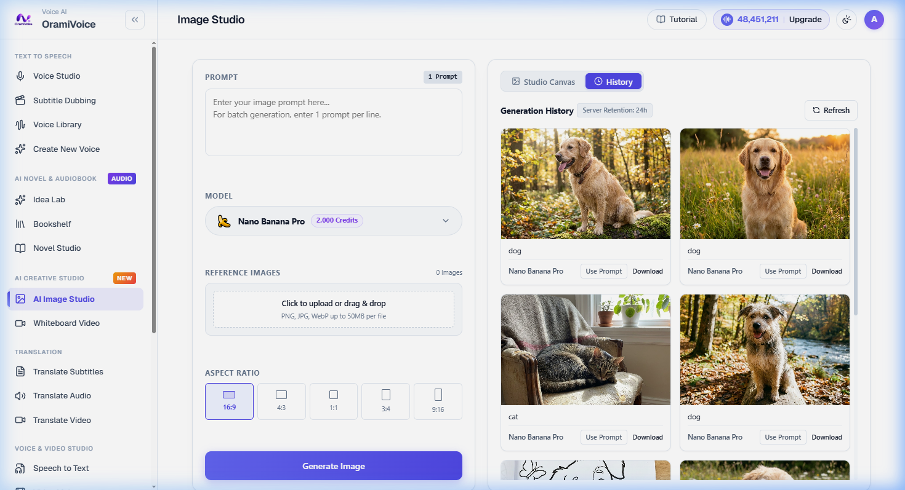

# AI Image Studio

The AI Image Studio (`/images.php`) is a visual synthesis workspace featuring single and batch image generation, multi-reference image conditioning (Img2Img), flexible aspect ratio presets, and automated watermark removal.

---

## Step-by-Step Creation Workflow

Follow these steps to create high-resolution digital art, social media visuals, or novel book covers:

### Step 1: Draft Your Prompt & Exclude Artifacts
- **Creative Prompt**: Type your scene description into the Prompt editor on the left. Detail the subject, artistic style, lighting, camera angle, and color mood.
  > *Example*: `Cinematic 35mm film portrait of an artisan clockmaker in a cozy warm workshop, 85mm lens, f/1.8 bokeh, volumetric light, 8k resolution.`
- **Negative Prompt (Exclude / Avoid)**: Specify unwanted features you want the AI model to omit or suppress (e.g. `blurry, bad anatomy, text, distorted, watermark, deformed hands, extra fingers`).
- **Batch Multi-Line Input**: To generate multiple distinct scenes simultaneously, enter one prompt per line.

### Step 2: Choose Your AI Model & Output Quantity
- **Luxury Model Selector**:
  - **Nano Banana Pro (2,000 credits)**: High-fidelity Google Flow v3 synthesis. Delivers realistic facial anatomy, complex materials, dramatic lighting, and studio-grade textures.
  - **Nano Banana (1,500 credits)**: Ultra-speed rendering mode ideal for rapid drafting, conceptual sketches, and storyboard exploration.
- **Image Quantity (1, 2, 3, 4)**: Choose how many variation images to generate per prompt. Credits dynamically update to reflect the batch size, and multi-image outputs render in the responsive Batch Matrix Stage.

### Step 3: (Optional) Add Reference Images (Img2Img)
- **Reference Images**: Drag and drop up to 5 reference images into the dropzone. Choose whether to apply references across all prompts or pair 1-to-1 with prompt lines.
- **Visual Conditioning**: Perfect for preserving character likeness, color palettes, or artistic styles across consecutive scene generations.

### Step 4: Select Camera Aspect Ratio
Select one of the 5 industry-standard framing ratios:
- `16:9 Landscape`: YouTube thumbnails, desktop banners, and cinematic widescreen.
- `4:3 Standard`: Editorial articles, blog headers, and photography.
- `1:1 Square`: Instagram feeds, profile avatars, and audiobook square album covers.
- `3:4 Portrait`: Digital book covers, poster art, and character cards.
- `9:16 Vertical`: TikTok, Instagram Reels, and YouTube Shorts.

### Step 5: Render Artwork
Click the prominent **Generate Image** button (`Ctrl + Enter`).
- The right-hand studio canvas enters rendering state with real-time status notifications.
- Synthesis completes within 5–10 seconds.
- The high-resolution output immediately renders on the dark monitor stage.

### Step 6: Fullscreen Lightbox & Clean Asset Download
- Click directly on the rendered image to open the **Adaptive Fullscreen Lightbox**.
- The lightbox automatically calculates resolution metrics and aspect ratios.
- Click **Copy Prompt** to duplicate the exact prompt.
- Click **Download** to save the pristine, watermark-free JPEG/PNG asset directly to your device.

---

## History & Batch Asset Management

Click the **[ History ]** tab at the top-left of the stage to review all previously generated assets:

- **Use Prompt**: Instantly reload any past prompt back into the Studio editor with 1 click.
- **Direct Download**: Download individual assets directly from their cards.
- **Batch ZIP Export**: When generating batches, use the **Download ZIP** action to download all completed images simultaneously in a single archive.
- **Server Retention**: Generated visual assets are safely stored on the server for **24 hours** for instant downloads before automated cache rotation.
