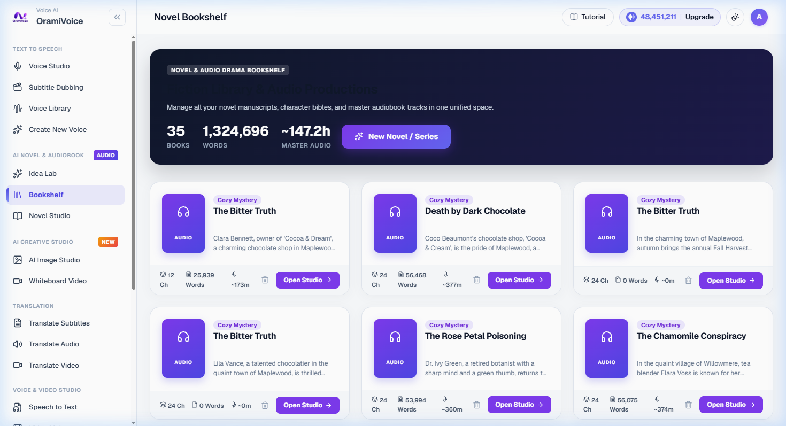

# Bookshelf Project Manager

The Bookshelf (`/novel_projects.php`) serves as the central hub for managing all your fiction titles, multi-chapter manuscripts, and serialized audio drama productions.

---

## Dashboard Overview

- **Production Metrics**: Live overview tracking total project count, aggregate manuscript word count, and estimated total audio runtime.
- **Project Cards**: Displays individual book cards with title, cover thumbnail, genre tag, target audience, chapter count, and last modified date.
- **Quick Actions**: Access Novel Studio, open the Character Bible, configure print presets, or archive projects from individual project menus.

---

## Creating a New Project

1. Navigate to **Bookshelf** (`/novel_projects.php`).
2. Click **New Book Project**.
3. Fill in basic metadata:
   - **Title & Subtitle**: Book title and optional series subtitle.
   - **Premise / Synopsis**: Brief summary of the core narrative.
   - **Genre & Audience**: Target demographic and genre classification.
4. Click **Create Project**. The system automatically redirects you into the **Novel Studio** workspace.
