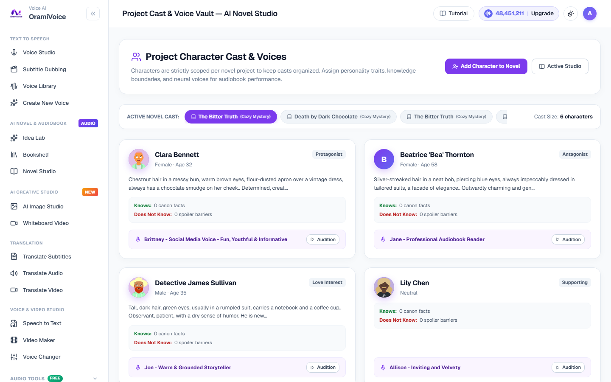

# Character Bible & Multi-Voice Casting

The Character Bible system (`/novel_characters.php` and `/novel_memory.php`) manages persistent character profiles and voice mappings for multi-chapter audiobook dramatizations.

---

## Character Configuration

Each character card in the Character Bible stores essential metadata used during voice staging and script parsing:

- **Character Name**: Primary character name and known aliases or nicknames.
- **Gender & Age Category**: Informs automatic voice filtering (e.g., Male/Female/Neutral, Child/Young/Middle-Aged/Elderly).
- **Assigned Voice**: Persistent voice model chosen from the active voice library.
- **Role & Importance**: Categorized as Protagonist, Antagonist, Supporting, or Minor.
- **Personality & Speaking Tone**: Emotional and expressive cues for vocal delivery.
- **Visual Description**: Narrative appearance notes for character reference and book cover styling.

---

## Automatic Dialogue Detection

When parsing a chapter, the engine separates speaking lines from narrative text:

1. **Quotation Analysis**: Extracts dialogue enclosed in standard quotation marks (`"..."` or `“...”`).
2. **Attribution Tagging**: Recognizes speech tags (e.g., `said Sarah`, `he muttered`, `shouted Mark`) to bind lines to the correct character in the Bible.
3. **Alternation Logic**: Resolves back-and-forth conversational turns between active participants in a scene.
4. **Manual Speaker Override**: Authors can click any dialogue line in the script editor to reassign the speaker immediately from a quick dropdown.

---

## Voice Consistency Across Chapters

Character voice assignments are linked globally to the novel project. When you create or import new chapters, existing character dialogues are instantly routed to their designated voices without requiring manual re-selection.
