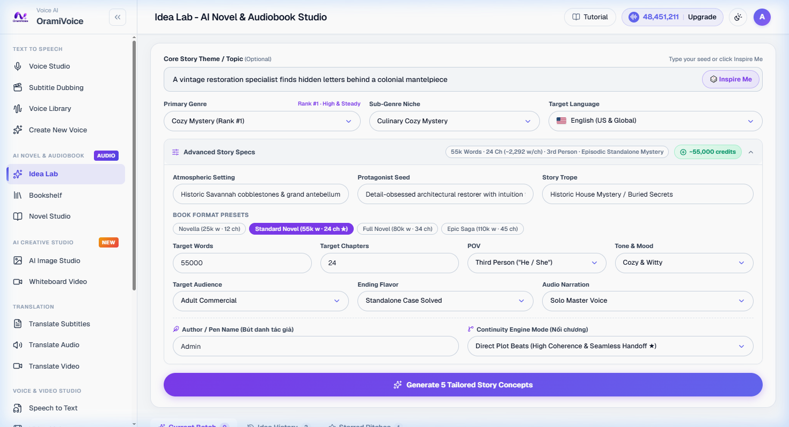

# Idea Lab

The Idea Lab (`/novel_ideas.php`) is a creative intelligence workstation designed to brainstorm narrative concepts, commercial fiction tropes, and market-aligned story premises for audiobooks and novels.

---

## Key Capabilities

- **Trending Genre Intelligence**: Access curated commercial fiction categories (LitRPG, Progression Fantasy, Romantic Suspense, Cyberpunk Thriller, Historical Drama, Contemporary Mystery).
- **Trope Combiner**: Mix classic storytelling hooks (Found Family, Enemies to Lovers, Reluctant Hero, Time Loop, Hidden Identity) to generate unique premises.
- **AI Outline Generation**: Automatically expands a high-concept idea into a multi-act plot outline with chapter-by-chapter pacing targets.
- **One-Click Project Transfer**: Transfer finalized story concepts directly into the Bookshelf to start chapter drafting.

---

## Brainstorming Workflow

1. Open **Idea Lab** (`/novel_ideas.php`).
2. Select your primary genre and target commercial appeal.
3. Choose 1 to 3 core tropes or enter custom keywords describing your premise.
4. Click **Generate Story Concepts**.
5. Review synthesized concepts, complete with logline, dramatic conflict, and character archetypes.
6. Click **Create Project in Bookshelf** to launch your new novel workspace.
