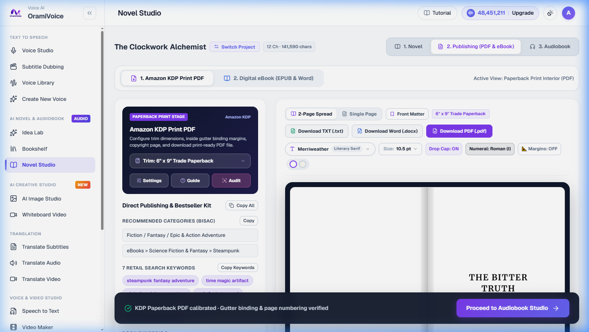

# Digital Book Publishing & Print Suite

The Publishing Suite (`/novel.php?tab=publishing`) provides automated book formatting, real-time print preview, and multi-format publication exports for authors and publishers.

---

## Publication Formats

- **Print-Ready PDF**: Typeset PDF with standard book margins, running headers, dynamic page numbering, chapter title ornaments, and drop caps.
- **EPUB E-Book**: Reflowable e-book format compliant with modern digital readers (Apple Books, Kobo, Google Play Books).
- **Amazon KDP Presets**: Pre-configured trim sizes and gutter margins optimized for Amazon Kindle Direct Publishing print-on-demand.
- **Master Chapter Audio (MP3/WAV)**: High-resolution audiobook master files formatted for ACX and global audiobook distributors.

---

## WYSIWYG Print PDF Preview

The built-in document renderer provides an exact visual representation of printed book pages before exporting:

- **Typography Selection**: Choose from 25+ curated literature and publishing typefaces (including Garamond, Baskerville, Merriweather, Lora, Alegreya, Bitter, Cardo, Faustina, Newsreader, and Playfair Display).
- **Trim Size Options**: Standard publication dimensions including 6 x 9 inches (Trade Paperback), 5.5 x 8.5 inches (Digest), and 5 x 8 inches (Mass Market).
- **Margin & Gutter Settings**: Customizable inner and outer margins to ensure clean spine clearance during binding.
- **Typesetting Controls**: Configure font size, line height, paragraph indentation, justified text alignment, and decorative first-letter drop caps.

---

## Book Cover Generator

The publishing suite includes an integrated cover design module:

1. Select your target book genre and cover layout template.
2. Provide a visual prompt or use the automated synopsis summarizer to generate high-resolution front cover artwork.
3. Overlay author name, title typography, and subtitle placement with fine-tuned font pairing.
4. Export publication-ready cover graphics in full resolution.
