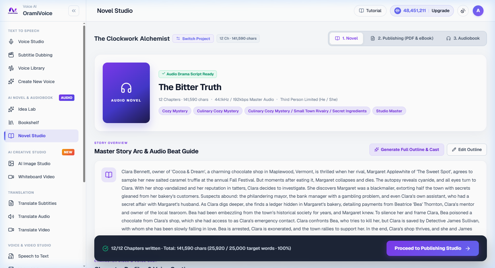

# AI Novel & Multi-Voice Audiobook Studio

The Novel Studio (`/novel.php`) is a multi-chapter production suite tailored for long-form fiction writing, character voice staging, multi-voice audiobook synthesis, and digital book publishing.

---

## Workspace Architecture

The studio provides an end-to-end environment for authors, audiobook creators, and publishers:

- **Project Hero & Episode Rail**: Horizontal chapter navigator with live word counts, estimated reading time, and audio synthesis status.
- **Manuscript Splitter**: Automatically parses raw novel manuscripts into structured, numbered chapters.
- **Character Bible & Casting**: Maintains persistent character profiles, age, gender, and assigned voice models across all chapters.
- **Audio Script Staging**: Decomposes chapter text into speaker dialogues and descriptive narration blocks.
- **Multi-Voice Audiobook Synthesizer**: Produces dramatized audio with individual character voices and narrator pacing.
- **Digital Publishing Suite**: WYSIWYG Print PDF generation with 25+ literature typefaces, EPUB e-book export, Amazon KDP format presets, and book cover design.

---

## Chapter Workflow

### Step 1: Project Setup & Manuscript Ingestion
1. Navigate to **Novel Studio** (`/novel.php`) and open or create a project.
2. Enter your manuscript text or paste full story chapters into the chapter editor.
3. Use the automatic chapter splitter to structure long drafts into distinct episodes.

### Step 2: Character Bible & Voice Assignment
1. Open the **Character Bible** tab (`/novel_characters.php`).
2. Define characters appearing in your story and assign a specific voice from the Voice Catalog.
3. Set a dedicated narrator voice for descriptive text passages.

### Step 3: Audio Script Parsing
1. In the chapter editor, trigger **Parse Dialogue & Staging**.
2. The engine segments dialogue lines in quotation marks from narrative paragraphs and assigns the corresponding character voice.
3. Review dialogue cues and adjust speaker tags or line boundaries if necessary.

### Step 4: Multi-Voice Audiobook Rendering
1. Click **Synthesize Chapter Audio**.
2. The synthesizer processes each dialogue line with its designated character voice and merges narration segments into a master chapter audio track.
3. Listen to the staged preview, regenerate individual lines if needed, and export the master MP3.
