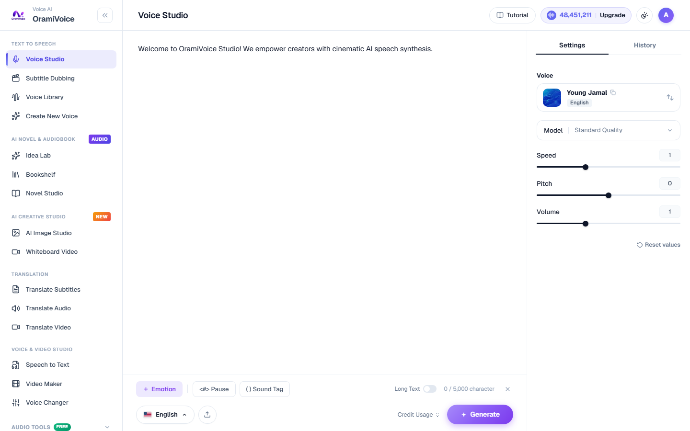
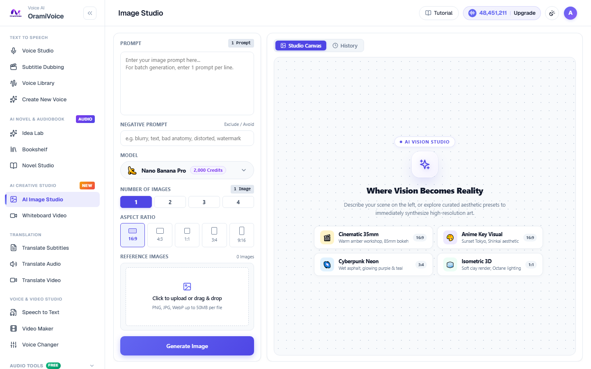

# Quickstart Guide

This tutorial provides a step-by-step walkthrough to get your workspace set up and generate your first voiceover and visual assets.

---

## 1. Account Setup & Authentication

1. Navigate to the registration page (`/register.php`) to create a new workspace account.
2. After logging in, verify your active credit balance displayed on the upper-right corner of the top navigation bar.
3. Access your Profile page (`/profile.php`) to configure your display preferences, email notifications, and API credentials.

---

## 2. Workspace Navigation

- **Text to Speech**: Voice Studio (`/speech.php`), Subtitle Dubbing (`/dubbing.php`), Voice Library (`/voices.php`), Create New Voice (`/voice-create`).
- **AI Novel & Audiobook**: Idea Lab (`/novel/ideas`), Bookshelf (`/novel`), Novel Studio (`/novel/studio`), Character Bible (`/novel_characters.php`), Digital Publishing.
- **AI Creative Studio**: AI Image Studio (`/images.php`), Whiteboard Video (`/media.php`).
- **Translation**: Translate Subtitles, Translate Audio, Translate Video (`/translate.php`).
- **Voice & Video Studio**: Speech to Text, Video Maker, Voice Changer (`/studio.php`).
- **Audio Tools (Free)**: 20 Browser-based audio engineering tools (`/tools.php`).
- **System & History**: Subscription (`/subscription.php`), History (`/history.php`), API Keys (`/api-keys.php`).

---

## 3. Workflow: Generating Your First Voiceover

The Voice Studio (`/speech.php`) is designed for instant typing, emotion styling, and studio-grade voiceover creation:

1. Open **Speech Studio** (`/speech.php`).
2. Paste or type your script into the editor.
3. Format conversational rhythm:
   - Insert pauses with `<#> Pause` (or type `<#`).
   - Insert non-verbal tags like `(laughter)` or `(sigh)` with `( ) Sound Tag` (or type `(`).
   - Highlight text and pick an emotional color tone with `+ Emotion`.

4. Select a narrator voice from the right panel. You can audition voice samples by clicking the speaker icon on any voice card.
5. Fine-tune **Speed**, **Pitch**, and **Volume** using the sliders.
6. Click **Generate Speech** (`Ctrl + Enter`).
7. Preview the audio on the bottom scrubber player and click **Download** to save your MP3 or WAV file.

---

## 4. Workflow: Generating Your First Visual Artwork

1. Open **Image Studio** (`/images.php`).
2. In the Prompt input field on the left panel, write a clear descriptive prompt.
3. Select your generation model:
   - **Nano Banana Pro** (2,000 credits): High-fidelity rendering with photorealistic detail.
   - **Nano Banana** (1,500 credits): High-speed rendering for rapid drafting.
4. Select the desired camera Aspect Ratio (`16:9`, `4:3`, `1:1`, `3:4`, or `9:16`).
5. Click **Generate Image**.
6. The rendered artwork appears on the Studio Canvas. Click **Download** to save the clean asset.
