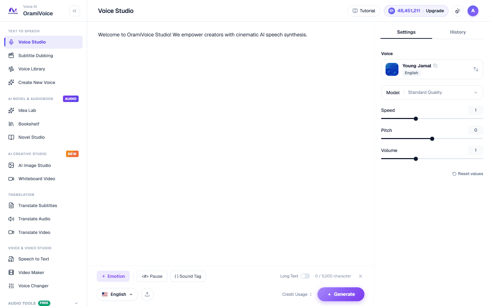
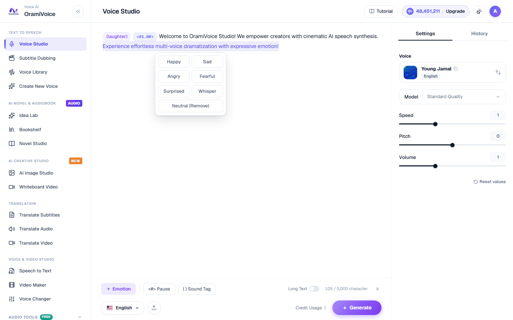

# SSML & Non-Verbal Tags Guide

OramiVoice provides both **intuitive UI shortcuts** for fast scriptwriting in the web editor and **standard SSML markup** for automated API pipelines.


---

## 1. Web Editor Shortcuts & Visual Chips

When writing directly in the Voice Studio editor (`/speech.php`), use these quick shortcuts:

### Pause Interval Chips
- **UI Action**: Type `<#` or click the `<#> Pause` button on the bottom toolbar.
- **Duration Presets**: Choose from `0.25s`, `0.5s`, `1.0s`, `1.5s`, or enter a custom value.
- **Editor Output**: Inserts an interactive chip such as `<#0.5#>` or `<#1.0#>`.


- **Example**:
```text
Welcome to OramiVoice. <#1.0#> Let us begin the presentation.
```

### Non-Verbal Sound Tags
- **UI Action**: Type `(` or click the `( ) Sound Tag` button.
- **Editor Output**: Inserts a formatted sound token chip.



- **Available Tags**:
  - `(laughter)`: Natural chuckling or laughter.
  - `(sigh)`: Soft exhalation or relief.
  - `(surprise-oh)`: Surprise exclamation "Oh".
  - `(surprise-ah)`: Surprise exclamation "Ah".
  - `(surprise-wa)`: Wonder or amazement "Wa".
  - `(confirmation-en)`: Agreeable acknowledgment "En / Ừm".
  - `(dissatisfaction-hnn)`: Skeptical grunt "Hnn".
- **Example**:
```text
That was completely unexpected (laughter) I never saw it coming!
```

### Emotion Highlighting
- **UI Action**: Highlight text with your cursor, click `+ Emotion`, and choose an emotional delivery style:
  - `Happy`, `Sad`, `Angry`, `Fearful`, `Surprised`, `Whisper`, `Neutral`.



- **Editor Output**: Wraps selected text in an emotion block:
```text
<emotion value="happy">We achieved all our goals ahead of schedule!</emotion>
```

---

## 2. Standard SSML & Non-Verbal Bracket Tags

For API requests or structured script files, the following standard markup is fully supported:

### Silence & Breathing (`<break>`)
- `<break time="1.0s" />` or `<break time="500ms" />`
- **Range**: `0.1s` to `5.0s`.

### Non-Verbal Bracket Notation
- `[laughter]`: Chuckling or laughter.
- `[sigh]`: Exhalation or sigh.
- `[surprise-oh]`, `[surprise-ah]`, `[surprise-wa]`, `[surprise-yo]`: Surprise exclamations.
- `[question-oh]`, `[question-ah]`, `[question-ei]`, `[question-yi]`, `[question-en]`: Inquiring inflections.
- `[confirmation-en]`: Agreeable acknowledgment.
- `[dissatisfaction-hnn]`: Skeptical grunt.

### Prosody & Pitch Control (`<prosody>`)
```xml
<prosody rate="-15%" pitch="low">This sentence is delivered with deeper gravitas.</prosody>
```

### Whispering (`<whisper>`)
```xml
He whispered softly: <whisper>Meet me tonight at the station.</whisper>
```
