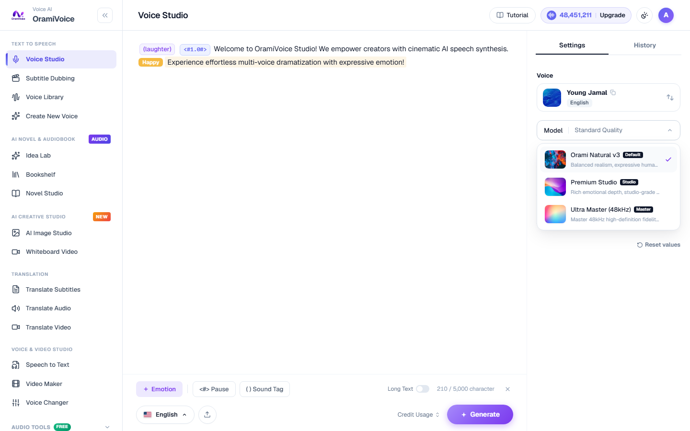

# Voice Studio (Text to Speech)

The Voice Studio (`/speech.php`) is the core speech generation workspace designed for high-fidelity multi-lingual synthesis, expressive dialogue styling, and granular rhythm control.

## Interactive Editor Demonstration

Watch the interactive editor in action below: inserting non-verbal sound tokens, configuring millisecond-accurate pauses, and highlighting text to apply colored emotional styling:

---

## Interactive Editor & UI Controls

The studio editor features an interactive typography canvas with inline badge chips and dynamic toolbar popovers:

### 1. Adding Pause & Breathing Intervals (`<#time#>`)
You can insert silence intervals at any point in your script to control natural conversational rhythm:
- **Button Shortcut**: Click the `<#> Pause` pill button at the bottom of the editor.
- **Typing Shortcut**: Simply type `<#` anywhere in your script text to trigger the popover.
- **Duration Quick-Bar**: An interactive popup appears with presets:
  `[ 0.25s ]` `[ 0.5s ]` `[ 1.0s ]` `[ 1.5s ]` `[ Customize ]`
- Selecting a preset (e.g. `1.0s`) inserts an interactive pill badge: `<#1.0#>` or `<#1#>`.
- You can click on any existing `<#1.0#>` chip in the editor to modify its duration or remove it.

### 2. Adding Sound & Non-Verbal Tags (`(tag)`)
Insert expressive human vocalizations seamlessly into speech using OmniVoice's native neural tokens:
- **Button Shortcut**: Click the `( ) Sound Tag` pill button on the bottom toolbar.
- **Typing Shortcut**: Type `(` anywhere in the editor to open the tag menu at your cursor position.
- **Available Tags**: `(laughter)`, `(sigh)`, `(surprise-oh)`, `(surprise-ah)`, `(surprise-wa)`, `(confirmation-en)`, `(dissatisfaction-hnn)`.
- Clicking a tag inserts a purple sound chip into your script.

### 3. Adding Emotional Expression (`+ Emotion`)
Apply distinct emotional coloring to specific sentences or phrases:
- **Highlight Text**: Select any portion of text in the editor using your mouse cursor.
- **Contextual Emotion Popover**: The floating 8-emotion menu appears immediately above the selected text.
- **Available Emotions**:
  - **Happy** (Amber): Cheerful, joyful, energetic delivery.
  - **Sad** (Blue): Melancholic, sorrowful, quiet delivery.
  - **Angry** (Red): Forceful, passionate, commanding tone.
  - **Fearful** (Purple): Nervous, trembling, suspenseful tone.
  - **Surprised** (Orange): Amazed, astonished tone.
  - **Whisper** (Teal): Intimate, soft, whispered delivery.
  - **Neutral** (Slate): Clear, balanced conversational tone (also removes emotion highlighting).
- The selected phrase is wrapped in a dedicated color badge and light tinted background.

---

## AI Model Selection & Voice Casting

### 1. Model Tiers
OramiVoice v3 provides three production models engineered for different speed and fidelity requirements:

- **Orami Turbo v3 (Fast · 16 steps)**: High-speed generation, saving 33% serverless rendering time. Ideal for quick drafting and short social media clips.
- **Orami Natural v3 (Default · 24 steps)**: Balanced natural cadence and rich emotion, perfect for podcasts, explainer videos, and audiobooks.
- **Orami Studio v3 (Studio · 32 steps)**: Maximum acoustic depth, harmonic warmth, and cinematic master clarity.

### 2. Voice Discovery & Audition
Click the Voice Card in the right-hand panel to open the Voice Discovery modal:

- **Instant Audition**: Click the play icon on any voice card to stream a live preview sample.
- **Filter by Country & Language**: Choose from 10,000+ supported international languages, voices, and regional accents.
- **Gender & Tags**: Filter quickly between Male, Female, and Neutral voices.
- **VIP Voices**: Official studio models with high dynamic range.

---

## Synthesis Options & Actions

- **Long Text Mode**: Toggle the **Long Text** switch in the upper-right corner for long manuscripts (up to 100,000+ characters) with automated paragraph batching.
- **Character Counter**: Real-time character counter tracks manuscript length against tier limits.
- **Speed, Pitch & Volume Controls**: Fine-tune delivery tempo (0.5x to 2.0x), vocal pitch (-12 to +12 semitones via FFmpeg rubberband), and volume (0.01 to 1.0) with real-time numeric badges and two-tone slider tracks.
- **Generate Speech**: Click **Generate Speech** (`Ctrl + Enter`) to synthesize broadcast-quality audio. The bottom player slides up with real-time shimmer wave animation and auto-plays the finished audio.
