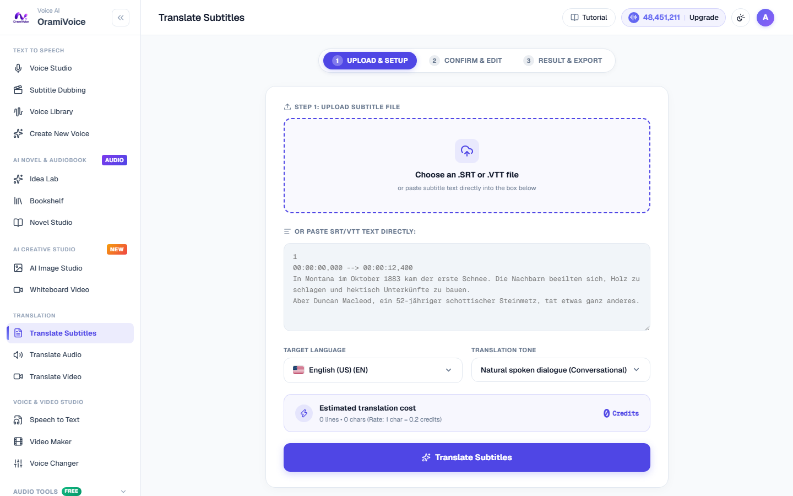

# Translate Video

The Video Translation tool (`/translate.php?mode=video`) localizes full video recordings into target languages, generating translated audio tracks and optional burned-in bilingual subtitles.

---

## Supported Formats

- **Video Inputs**: MP4, MOV, WebM, MKV (up to 500MB).
- **Video Outputs**: Localized MP4 video, standalone translated audio (MP3/WAV), or translated subtitles (SRT/VTT).

---

## Translation Features

- **Automated Voiceover Replacement**: Replaces original speech tracks with synchronized foreign-language voiceovers.
- **Background Audio Preservation**: Retains ambient sound effects and background music while replacing spoken dialogue.
- **Bilingual Subtitle Overlay**: Option to embed open subtitles or dual-language captions directly into the rendered video.

---

## How to Translate a Video

1. Navigate to **Translate Video** (`/translate.php?mode=video`).
2. Upload your source video file.
3. Select source and target languages, and pick a matching voice persona for the voiceover.
4. Choose subtitle display options (burned-in subtitles, dual-language display, or audio-only).
5. Click **Render Translated Video**. Once processing completes, download your localized video.
