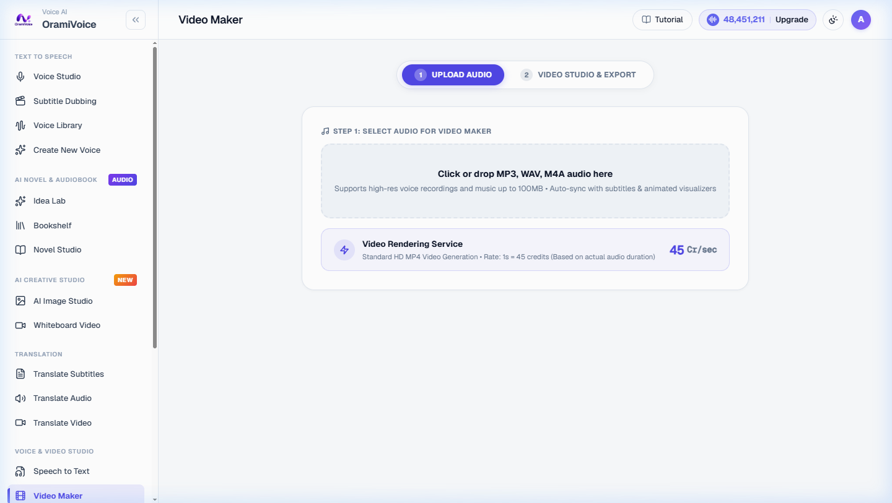

# Video Maker & Audiograms

The Video Maker (`/studio.php?mode=video-maker`) transforms audio recordings, voice clips, and podcast highlights into animated audiogram videos designed for social media sharing.

---

## Visual & Animation Features

- **Dynamic Audio Waveforms**: Choose from multiple reactive sound visualizer styles (Classic Waveform, Equalizer Bars, Circular Visualizer, Neon Line).
- **Animated Word-by-Word Captions**: Highlight active spoken words in real time with customizable fonts, colors, and text sizes.
- **Multi-Format Canvas Layouts**:
  - **9:16 Portrait**: Optimized for TikTok, Instagram Reels, and YouTube Shorts.
  - **1:1 Square**: Tailored for Instagram feed posts and LinkedIn.
  - **16:9 Landscape**: Formatted for YouTube long-form and web players.
- **Custom Backgrounds & Overlays**: Upload custom brand graphics, background photos, or use gradient color fills.

---

## Operating Steps

1. Open **Video Maker** (`/studio.php?mode=video-maker`).
2. Upload your audio file (or select a generated clip from your Voice Studio history).
3. Select your target canvas ratio (9:16, 1:1, or 16:9).
4. Customize the waveform animation style and position.
5. Configure subtitle styling, typography, and highlight colors.
6. Upload or select a background image.
7. Click **Generate Video** to render your Full HD MP4 audiogram.
