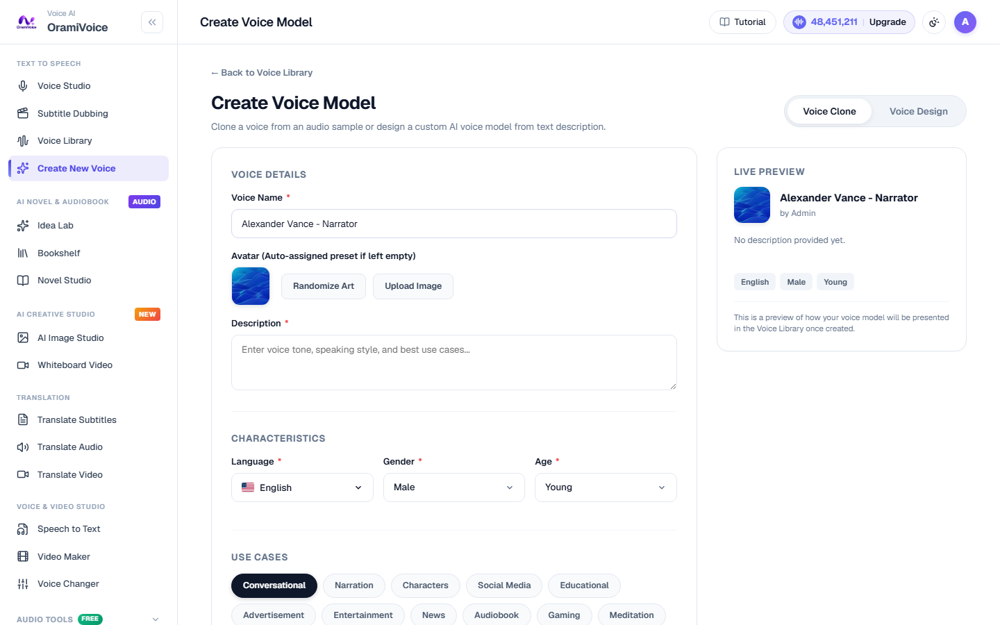

# Voice Cloning & Custom Voices

The Voice Cloning Studio (`/voice-create.php`) allows you to replicate any unique human voice from recorded audio samples, producing a fully expressive AI voice replica capable of speaking in any supported language.

---

## Audio Reference Guidelines

The quality of your cloned voice is directly determined by the acoustic clarity of your uploaded reference recording:

### Recommended Audio Specifications:
- **Duration**: 1 to 5 minutes of continuous, clear speech.
- **Audio Format**: Clean WAV (44.1kHz or 48kHz, 16-bit) or high-bitrate MP3 (320kbps).
- **Acoustic Environment**: Minimal background noise, zero room echo/reverb, and no overlapping background music.
- **Speaker Delivery**: Consistent natural conversational tone without extreme shouting or whispering.

---

## Step-by-Step Cloning Workflow

### Step 1: Prepare Your Audio File
Ensure your audio recording contains only a single speaker speaking clearly. Use the built-in **Audio Tools** (`/tools.php`) to strip background noise, cut silence, or isolate vocals if necessary.

### Step 2: Upload Reference Sample
1. Navigate to **Create Voice** (`/voice-create.php`) from the sidebar or via the button in the Voice Library.
2. Enter a descriptive **Voice Name** (e.g., `Alexander - Documentary Narrator`).
3. Select the primary **Gender**:
   - `Male`
   - `Female`
   - `Neutral`
4. Search and select the primary **Language** from the 10,000+ supported international languages and voices.
5. Drag and drop your audio reference file into the dropzone (WAV, MP3, M4A up to 50MB).

### Step 3: Configure Metadata & Labels
- **Description**: Add contextual notes regarding tone, vocal weight, or intended project use.
- **Tags**: Add comma-separated descriptive tags (e.g., `calm`, `authoritative`, `storytelling`, `deep-voice`) to facilitate search and categorization.

### Step 4: Train & Validate Model
Click **Create Voice Model**. The system analyzes vocal timbre, formant resonance, and speech cadence in seconds. Once trained, the new voice is immediately available across:
- **Voice Studio** (`/speech.php`)
- **Subtitle Dubbing** (`/dubbing.php`)
- **Novel Studio & Character Casting** (`/novel.php`)

---

## Ethical Guidelines & Consent

> **Voice Ownership Policy**: You must have the explicit consent and authorization of the speaker whose voice is being cloned. Using cloned voices to impersonate individuals without consent, generate deceptive audio, or violate privacy rights is strictly prohibited.
