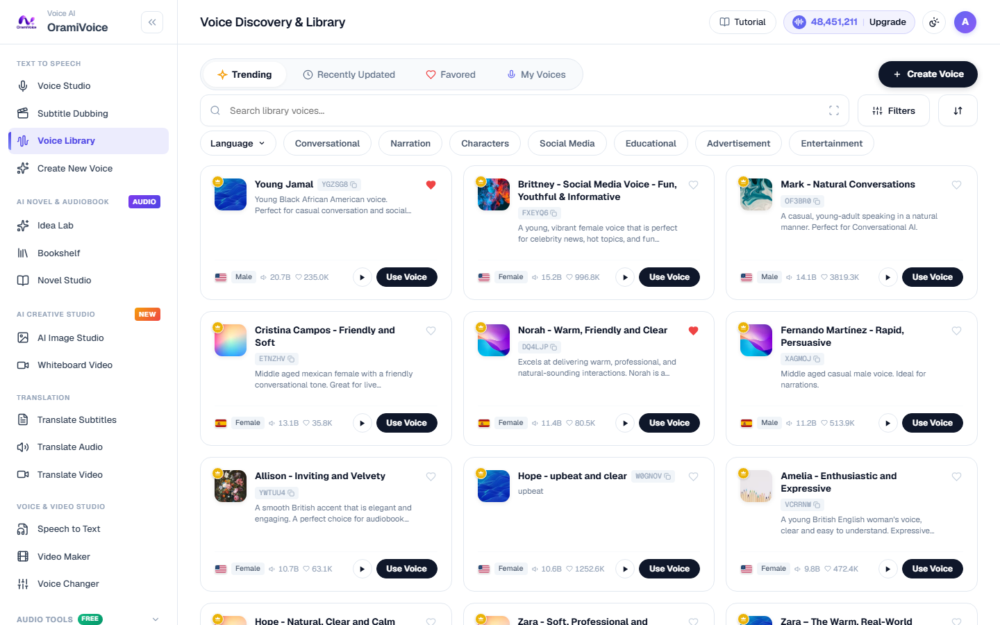
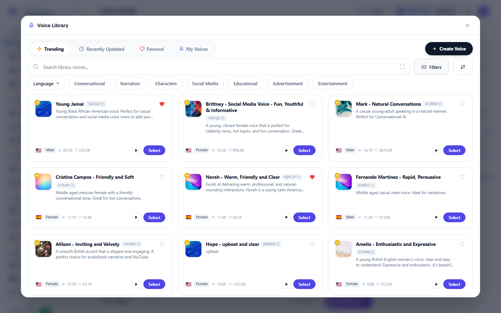

# Voice Library & Discovery

The Voice Library (`/voices.php`) contains hundreds of broadcast-quality neural voice models across global languages, regional accents, and tonal personas.

---

## Filtering & Navigation Controls

The discovery portal is built for rapid auditioning and voice casting:

- **Search Bar**: Search voices in real time by speaker name, description, or tonal characteristics (e.g. `documentary`, `narration`, `podcast`, `warm`, `cinematic`).
- **Country & Language Dropdowns**: Filter voices by regional origins with FlagCDN high-definition vector flag icons.
- **Gender & Tone Badges**:
  - `Female` (Rose badge)
  - `Male` (Blue badge)
  - `Neutral / Character` (Purple badge)
- **Audio Sample Player**: Click the play icon on any card to audition high-resolution audio samples without reloading the page.
- **Copy Voice ID**: Click the copy icon next to any voice ID to paste it directly into API calls or automation pipelines.

---

## Voice Studio Drawer Integration

When working inside the **Voice Studio** (`/speech.php`), the full library is accessible directly through the embedded Voice Discovery modal:

1. Click the active **Voice Card** in the right-hand panel of the Voice Studio.
2. Search or filter through the catalog.
3. Audition voices on the fly by clicking the play button on any card.
4. Click **Select** to bind the chosen voice to your current workspace session. The selection is automatically remembered across browser reloads via local cookie persistence.
